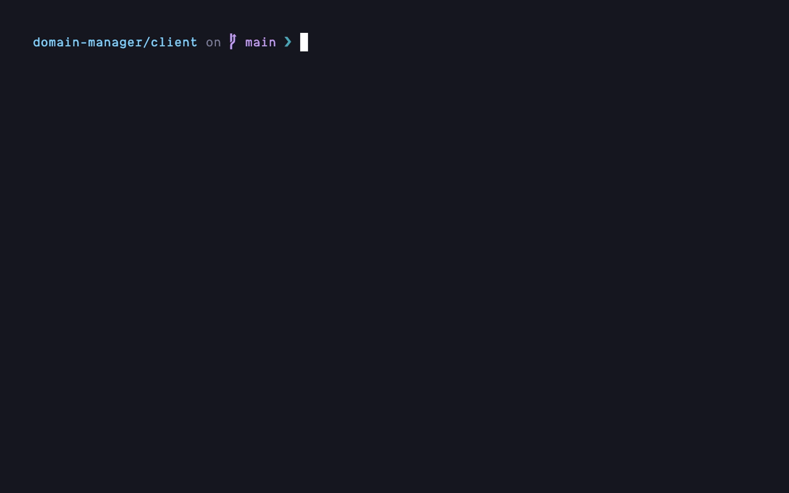

 # npr - npm script runner

A CLI tool that lets you browse and execute npm, pnpm, yarn, or bun scripts from a local project.



## Installation

To install the compiled version of the package run:

```sh
go install github.com/mohammedyh/npr@latest
```

> [!IMPORTANT]
> `go/bin` needs to be in your PATH to be able to run the command.
>
> Add the following to your shell config file: `export PATH="$PATH:$HOME/go/bin"`

Once installed, simply run `npr`

### Build From Source

Clone the repo:

```sh
git clone https://github.com/mohammedyh/npr
```

`cd` into the directory

```sh
cd ~/Dev/npr
```

Build and output executable

```sh
go build
```

After compiling into an executable, you could move the executable file to somewhere suitable in your filesystem and create an alias in your shell to reference it.

For example - if you moved the executable to the `.config` folder:

```sh
alias npr="~/.config/npr"
```

## Features

- Display scripts in an interactive list which can be navigated through using vim motions or arrow keys
- Auto-detect package manager from npm, pnpm, yarn and bun
- Scripts are sorted in alphabetical order
- Auto-install dependencies if package.json is found but `node_modules` isn't


## Todo

- [ ] Look at how to properly structure a Go program
